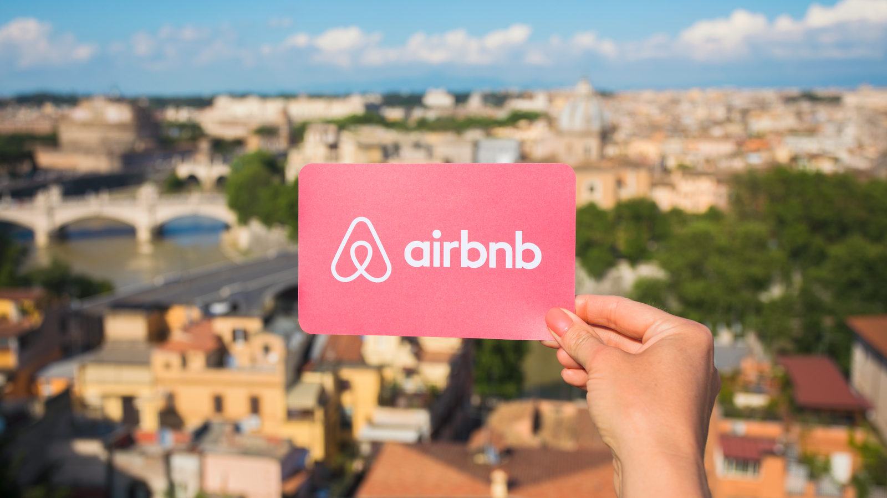

#  Project 3: Web APIs & NLP

**Executive Summary**

**Background & Purpose**: Airbnb, as a global accommodation and experience booking platform, seeks to tap into emerging travel trends, particularly for Japan and Korea, given the recent border reopening and rising interest. Recognizing the wealth of real-time traveler insights on the r/JapanTravel and r/KoreaTravel Reddit subreddits, Airbnb aims to leverage this user-generated content to refine its strategies and offerings.

**Objective**: Extract trending topics and keywords from these subreddits to:
- Determine popular travel trends in Japan and Korea.
- Understand travelers' preferences, concerns, and experiences.
- Spot new market opportunities or underserved regions.

**Methodology**:
1. **Data Extraction**: Extract comments and metadata from the subreddits via Reddit API.
2. **Preprocessing and Text Cleaning**: Prepare the raw text for analysis.
3. **Keyword Extraction**: Identify prominent words/phrases using NLP techniques.
4. **Trend Analysis**: Assess keyword frequency and context over time.
5. **Insight Generation and Reporting**: Highlight major trends and insights for Airbnb.

**Score Analysis**: Metrics like precision, recall, F1 score, accuracy, and specificity were considered to evaluate model performance. Notably, recall was identified as an area for improvement.

**Findings**:
- The models, especially CountVectorizer with Multinomial Naive Bayes, show promise in predicting travel trends.
- The current accuracy, around 57%, is a solid starting point, indicating an understanding of traveler sentiments and interests.
- Insights from these models can aid Airbnb in promoting relevant offerings, improving service quality, fine-tuning marketing, and spotting potential new markets.

**Recommendations**:
- Use model insights for strategy development, addressing traveler concerns, enhancing marketing efforts, and identifying potential new markets.
- Match model insights with real-world observations for validation and effectiveness.

**Continuous Improvement**:
- Emphasize domain-specific knowledge by curating relevant keywords for Japan and Korea.
- Explore topic modeling using algorithms like LDA for in-depth thematic insights.
- Incorporate feedback mechanisms and regular model retraining to stay updated with evolving trends.

**Conclusion**: The NLP models present a promising avenue for Airbnb to gain insights into real-time travel trends in Japan and Korea. By continuously refining the model and incorporating feedback, Airbnb can strategically adapt to changing traveler preferences, enhancing its platform offerings and user satisfaction.

